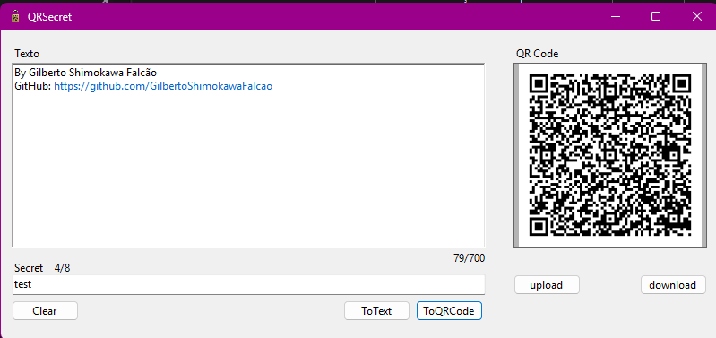
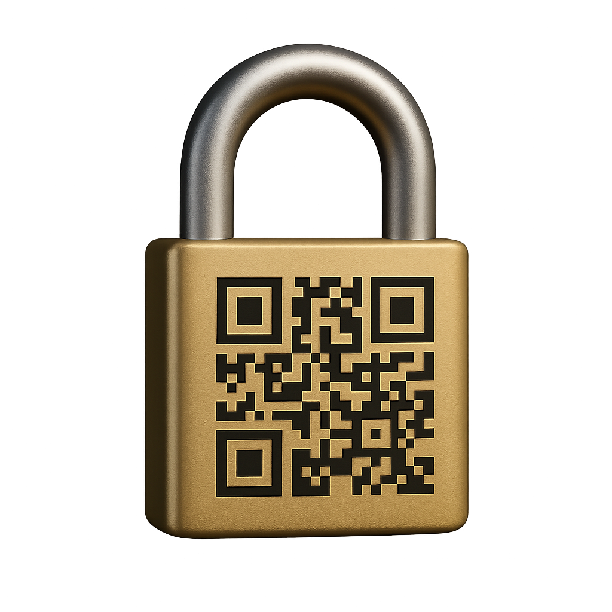

# QRSecret 🔐

Aplicação desktop simples para **converter texto em QR Code** e **QR Code em texto**, com suporte opcional a **criptografia por senha (secret)**.



Ideal para:
- guardar informações em QR
- compartilhar textos de forma simples
- proteger conteúdo com uma camada básica de criptografia
- uso pessoal / local (offline)

---

## ✨ Funcionalidades

- Converter **Texto → QR Code**
- Converter **QR Code → Texto**
- Criptografia opcional via **secret**
- Upload e download de imagens QR
- Funciona 100% offline

---



## 🧰 Utilidades Práticas

Alguns exemplos reais do que você pode fazer com o **QRSecret**:

- 🔐 **Criptografar chaves de carteira de criptomoedas**  
  (seed, private key, endereço, instruções — *não perca a senha*)

- 📄 Guardar **informações sensíveis** em QR Code  
  (anotações pessoais, dados de acesso, observações privadas)

- 🧳 Criar **QR Codes offline** para backup físico  
  (papel, caderno, cofre, pendrive isolado)

- 🔁 Compartilhar texto via QR  
  (sem depender de internet, conta ou nuvem)

- 🧪 Testes, estudos e uso pessoal  
  (didático, simples e previsível)

⚠️ **Importante:**  
O QRSecret **não substitui** um cofre de senhas profissional.  
Ele é uma ferramenta **local, offline e direta**, pensada para controle e simplicidade.


## ✅ Requisitos para rodar

### Opção A — Rodar o executável (recomendado)
Se você baixou um `.exe` pronto, basta:
- Windows 10/11
- **.NET 9.0 Desktop Runtime** instalado

> Se ao abrir o app aparecer mensagem pedindo “instalar .NET”, instale o runtime.

### Opção B — Compilar o projeto (para devs)
Para abrir/compilar o projeto você precisa:
- **.NET SDK 9.0** instalado
- Visual Studio (ou `dotnet` via terminal)

---


## ⚙️ Instalação rápida

### 1) Instalar o .NET 9.0
Instale **uma** das opções abaixo:

- Para **rodar** o app: **.NET 9.0 Desktop Runtime**
- Para **compilar** o app: **.NET SDK 9.0**

Depois confirme no terminal:

```bash
dotnet --version

## 📏 Limites

- **Texto:** até `700 caracteres`
- **Secret (senha):** até `8 caracteres`